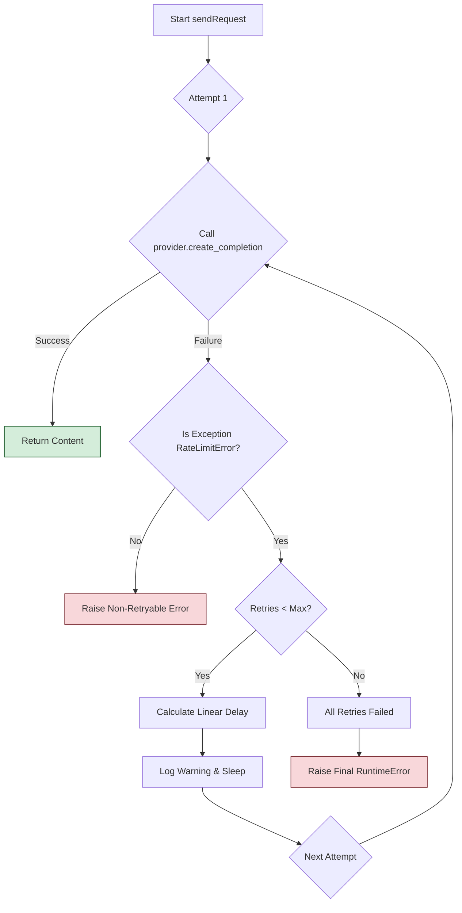

# Implementation Plan: Linear Backoff for LLM API Retries

This document outlines a plan to implement a robust retry mechanism with linear backoff for the LLM API clients within the `aicoder` application. This will improve the tool's resilience to transient rate-limiting issues (HTTP 429 Too Many Requests).

## Core Objective

Modify the LLM request logic to automatically retry on `429` errors. The delay between retries will increase linearly, starting from a minimum value and capped at a maximum value, over a configurable number of attempts.

## Key Concepts

*   **Linear Backoff:** The sleep delay increases by a fixed amount for each subsequent retry. For example, if the initial delay is 2s and the step is 4s, the delays would be 2s, 6s, 10s, 14s, etc.
*   **Configuration:** The behavior will be controlled by three constants:
    *   `LLM_RETRY_COUNT`: Maximum number of retries.
    *   `LLM_RETRY_MIN_DELAY`: The initial sleep delay in seconds.
    *   `LLM_RETRY_MAX_DELAY`: The maximum possible sleep delay.
*   **Targeted Error:** The retry logic will only trigger for HTTP `429 Too Many Requests` errors.

---

## Phase 1: Configuration

The first step is to establish the configuration parameters that will control the retry logic. This ensures the behavior is easily adjustable without code changes.

### 1.1. Add Retry Configuration to `aicoder/config.py`

Update the `Config` class to include the new retry parameters with sensible defaults.

**File:** `aicoder/config.py`

```python
# config.py
class Config:
    # Default profile to use if none specified
    APP_VERSION = "1.0.0"
    DEFAULT_PROFILE = "default"
    
    # Default temperature setting for LLM requests
    DEFAULT_TEMPERATURE = 0.0

    # ---- NEW: Retry Mechanism Configuration ----
    # Maximum number of retries on rate limit errors (HTTP 429)
    LLM_RETRY_COUNT = 5

    # Minimum delay in seconds for the first retry
    LLM_RETRY_MIN_DELAY = 2

    # Maximum delay in seconds for any single retry
    LLM_RETRY_MAX_DELAY = 30
    
    # Legacy model setting - kept for backward compatibility
    # ... (rest of the file remains unchanged)
```

---

## Phase 2: Implement Core Retry Logic

This phase involves modifying the central API client to handle the retry loop. We will target `LLMClient.sendRequest` as it's the common entry point before provider-specific calls.

### 2.1. Update `LLMClient.sendRequest` in `aicoder/llm/api_client.py`

Wrap the call to `self.provider.create_completion` within a `for` loop that implements the retry logic.

**File:** `aicoder/llm/api_client.py`

**Before:**

```python
// ... imports

class LLMClient:
    // ... __init__ and other methods

    def sendRequest(self, systemPrompt: str, userPrompt: str, verbose: bool = True) -> str:
        """Send PHP code to LLM and return documented version"""

        myLogger.debug(f"LLM Prompt:\n{userPrompt}", highlight=False)

        try:
            # ... (message setup)

            content = self.provider.create_completion(self.model, messages, verbose)

            return content

        except Exception as e:
            # ... (error handling)
            raise RuntimeError(f"LLM API failed: {str(e)}\n{debug_info}") from e
```

**After:**

```python
import json
import time
import yaml
from pathlib import Path
from typing import Optional, Dict

# ---- Add necessary imports ----
from openai import RateLimitError as OpenAiRateLimitError
from requests.exceptions import HTTPError as RequestsHTTPError
from .providers import OpenAIApiAdapter, OpenRouterApiAdapter
from ..utils.logger import myLogger
from ..config import Config # Import the Config class

# ... (_resolve_model_alias function)

class LLMClient:
    # ... __init__ and other methods

    def sendRequest(self, systemPrompt: str, userPrompt: str, verbose: bool = True) -> str:
        """Send PHP code to LLM and return documented version, with retry logic."""

        myLogger.debug(f"LLM Prompt:\n{userPrompt}", highlight=False)

        messages = [
            {"role": "system", "content": systemPrompt},
            {"role": "user", "content": userPrompt}
        ]
        
        # Calculate the linear step for the delay increase
        # Avoid division by zero if retry count is 1
        if Config.LLM_RETRY_COUNT > 1:
            delay_step = (Config.LLM_RETRY_MAX_DELAY - Config.LLM_RETRY_MIN_DELAY) / (Config.LLM_RETRY_COUNT - 1)
        else:
            delay_step = 0

        last_exception = None

        for attempt in range(Config.LLM_RETRY_COUNT + 1): # +1 to include the initial attempt
            if attempt > 0:
                # This is a retry attempt
                sleep_duration = Config.LLM_RETRY_MIN_DELAY + (attempt - 1) * delay_step
                sleep_duration = min(sleep_duration, Config.LLM_RETRY_MAX_DELAY) # Cap the delay
                
                myLogger.warning(
                    f"Rate limit exceeded. Retrying in {sleep_duration:.1f} seconds... "
                    f"(Attempt {attempt}/{Config.LLM_RETRY_COUNT})"
                )
                time.sleep(sleep_duration)

            try:
                content = self.provider.create_completion(self.model, messages, verbose)
                return content

            except (OpenAiRateLimitError, RequestsHTTPError) as e:
                last_exception = e
                # For requests, we need to check the status code explicitly
                if isinstance(e, RequestsHTTPError):
                    if e.response.status_code != 429:
                        # Not a rate limit error, re-raise immediately
                        raise e
                # For OpenAiRateLimitError, the type itself is enough.
                # Continue to the next attempt in the loop.
                continue

            except Exception as e:
                # Handle other unexpected errors
                debug_info = (
                    f"\nAPI Error Details:\n"
                    f"- Model: {self.model}\n"
                    f"- Provider: {self.provider_name}\n"
                    f"- Prompt Length: {len(userPrompt):,} chars\n"
                )
                raise RuntimeError(f"LLM API failed with a non-retryable error: {str(e)}\n{debug_info}") from e
        
        # If the loop completes without returning, all retries have failed
        raise RuntimeError(
            f"LLM API request failed after {Config.LLM_RETRY_COUNT} retries. "
            f"Last error: {str(last_exception)}"
        ) from last_exception
```

### 2.2. Verify Provider Exceptions

Ensure the provider implementations in `aicoder/llm/providers/` allow `RateLimitError` and `HTTPError` to propagate up to the `LLMClient`. The current implementation does this by catching a broad `Exception` or `APIError`, which is sufficient for our purpose, but could be refined. The logic added in `sendRequest` correctly anticipates the specific exception types.

---

## Phase 3: Testing

Testing this feature requires simulating a `429` response from the LLM provider. This is best done using `unittest.mock`.

### 3.1. Create a Unit Test

A new test file should be created to verify the retry logic.

**File:** `tests/test_api_client_retries.py` (new file)

```python
import unittest
import time
from unittest.mock import patch, Mock
from openai import RateLimitError
from requests.exceptions import HTTPError

from aicoder.llm.api_client import LLMClient
from aicoder.config import Config

class TestApiClientRetries(unittest.TestCase):

    def setUp(self):
        # Set short delays for faster testing
        Config.LLM_RETRY_COUNT = 3
        Config.LLM_RETRY_MIN_DELAY = 0.1
        Config.LLM_RETRY_MAX_DELAY = 0.3

    @patch('aicoder.llm.providers.openai.OpenAIApiAdapter.create_completion')
    @patch('aicoder.llm.api_client._resolve_model_alias', return_value='openai/gpt-4')
    def test_openai_retry_logic(self, mock_resolve, mock_create_completion):
        """Verify that the client retries on OpenAI RateLimitError and eventually succeeds."""
        
        # Simulate two failures then a success
        mock_create_completion.side_effect = [
            RateLimitError("Rate limit exceeded", response=Mock(), body=None),
            RateLimitError("Rate limit exceeded", response=Mock(), body=None),
            "Success!"
        ]
        
        client = LLMClient(modelWithPrefix='openai/gpt-4')
        
        start_time = time.time()
        response = client.sendRequest("system prompt", "user prompt")
        end_time = time.time()
        
        self.assertEqual(response, "Success!")
        self.assertEqual(mock_create_completion.call_count, 3)
        # Check if it slept for at least min_delay + (min_delay + step)
        self.assertGreater(end_time - start_time, 0.1 + 0.2) 

    @patch('aicoder.llm.providers.openrouter.OpenRouterApiAdapter.create_completion')
    @patch('aicoder.llm.api_client._resolve_model_alias', return_value='openrouter/some-model')
    def test_openrouter_retry_failure(self, mock_resolve, mock_create_completion):
        """Verify that the client fails after all retries are exhausted."""
        
        # Simulate a 429 response
        mock_response = Mock()
        mock_response.status_code = 429
        http_error = HTTPError(response=mock_response)

        mock_create_completion.side_effect = http_error
        
        client = LLMClient(modelWithPrefix='openrouter/some-model')

        with self.assertRaises(RuntimeError) as context:
            client.sendRequest("system prompt", "user prompt")
            
        self.assertIn("failed after 3 retries", str(context.exception))
        self.assertEqual(mock_create_completion.call_count, 4) # 1 initial + 3 retries

if __name__ == '__main__':
    unittest.main()
```

---

## Phase 4: Documentation

Finally, document the new configuration options for users.

### 4.1. Update `aicoder/.env.example`

Add the new variables to the example environment file so users are aware of them.

**File:** `aicoder/.env.example`

```ini
# LLM API Configuration
OPENROUTER_API_KEY=your_key_here

# Application Settings
DEFAULT_LLM_PROVIDER=deepseek

# ---- Optional: Retry Mechanism ----
# LLM_RETRY_COUNT=5
# LLM_RETRY_MIN_DELAY=2
# LLM_RETRY_MAX_DELAY=30
```

*Note: It's better to manage these in `aicoder/config.py` as implemented in Phase 1, but adding them commented-out in `.env.example` can serve as documentation for future override capabilities.*

### 4.2. Update Configuration `README.md`

Briefly mention the retry behavior in a relevant documentation file.

**File:** `config/README.md` (or a more general configuration doc)

Add a new section:

```markdown
## Error Handling and Retries

The application includes an automatic retry mechanism for handling API rate limits (HTTP 429 errors). When a rate limit is hit, the tool will automatically wait and retry the request. The behavior is configured in `aicoder/config.py`:

-   `LLM_RETRY_COUNT`: The number of times to retry a failed request.
-   `LLM_RETRY_MIN_DELAY`: The initial wait time in seconds before the first retry.
-   `LLM_RETRY_MAX_DELAY`: The maximum time to wait between retries.

The delay between retries increases linearly from the minimum to the maximum delay over the configured number of retries.
```

## Flow Diagram of the New Logic




